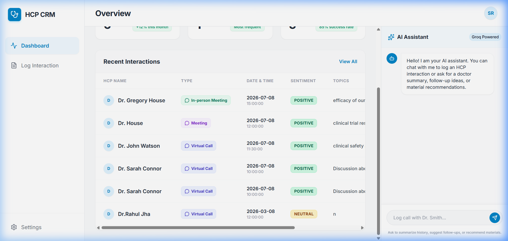

# 🩺 AI-First HCP CRM – Interaction Log Module

An AI-First Customer Relationship Management (CRM) Healthcare Professional (HCP) module designed for life sciences field representatives. It features a modern, responsive React/Redux frontend, a FastAPI Python backend, and an intelligent **LangGraph Agent** powered by Groq (`gemma2-9b-it`) and a **Keyless Free LLM Fallback** for instant out-of-the-box evaluations.

---

## 🎬 Video Walkthrough & Interface Demo

### Live CRM Walkthrough
Demonstrates logging doctor visits manually via the form, viewing it instantly on the dashboard, and executing all 5 AI Chat tools (logging, editing, history summary, material recommendations, and next-step recommendations) with the keyless free LLM engine.


### Dashboard Screenshot


---

## ✨ Key Features & Enhancements

*   **Dual Interaction Logging:** Reps can log visits using a polished, structured form or through the conversational **AI Chat Sidebar**.
*   **Keyless Free AI Fallback (New):** If a `GROQ_API_KEY` is not provided in `.env`, the system automatically routes requests to a keyless free LLM engine (`gpt-4o-mini` via `g4f`). The fallback model performs dynamic intent classification and entity extraction, so all 5 AI tools can be fully tested without configuring credentials!
*   **5 AI-Sales Tools (LangGraph Engine):**
    1.  `log_interaction_tool`: Parses conversation text to extract HCP name, date, topics, sentiment, outcomes, and follow-up actions and save them to the database.
    2.  `edit_interaction_tool`: Modifies specific fields of an interaction record in the database by ID (e.g. updating sentiment to Neutral).
    3.  `hcp_summary_tool`: Retrieves and formats the historical interaction log for a doctor.
    4.  `material_recommendation_tool`: Suggests relevant clinical trial brochures, Quick Dosing guides, or safety leaflets based on topics discussed.
    5.  `follow_up_recommendation_tool`: Analyzes sentiment and outcomes to recommend structured sales next-steps.
*   **Full Mobile Responsiveness:** Navigational drawer sidebar and sliding AI Chat sidebar drawers with overlays make the entire CRM fully responsive across mobile, tablet, and desktop views.
*   **Multi-Database Driver Support:** Equipped with drivers for PostgreSQL (`psycopg2-binary`) and MySQL (`pymysql`) alongside local SQLite.
*   **Modern Typography & Styling:** Built on Google Inter font with curated, tailormade emerald, indigo, and sky-blue status badge colors.

---

## 📁 Repository Structure

```
├── backend/
│   ├── venv/             # Local Python Virtual Environment
│   ├── main.py           # FastAPI entrypoint and endpoints
│   ├── agent.py          # LangGraph React Agent & Keyless Fallback Engine
│   ├── tools.py          # 5 CRM activities tool definitions
│   ├── database.py       # SQLAlchemy engine & session maker
│   ├── models.py         # SQLAlchemy DB models (Interactions)
│   ├── schemas.py        # Pydantic schemas
│   ├── crud.py           # Database operations
│   └── requirements.txt  # Python package list
├── frontend/
│   ├── src/
│   │   ├── components/   # React Components (Dashboard, FormLog, AIChat)
│   │   ├── store/        # Redux toolkit store & slices
│   │   ├── App.jsx       # Responsive layout container
│   │   └── index.css     # Tailwind imports and Inter font loader
│   ├── package.json      # React dependencies and scripts
│   └── tailwind.config.js# Tailwind style configs
└── media/
    ├── dashboard.png     # Final dashboard view asset
    └── walkthrough.webp  # Walking demo video asset
```

---

## 🚀 Setup & Execution Guide

### 1. Backend Setup

Open a terminal in the `backend/` directory:

```bash
cd backend

# Create a virtual environment
python -m venv venv

# Activate the environment
# On Windows:
venv\Scripts\activate
# On Mac/Linux:
source venv/bin/activate

# Install dependencies
pip install -r requirements.txt

# Run the FastAPI server
uvicorn main:app --reload --port 8000
```
*   *Note: If you have a Groq API key, you can add it to `.env` as `GROQ_API_KEY=your_key` to run the LangGraph model. Otherwise, the backend automatically uses the keyless Free AI model.*

The backend will run at [http://localhost:8000](http://localhost:8000)  
Swagger interactive docs: [http://localhost:8000/docs](http://localhost:8000/docs)

### 2. Frontend Setup

Open a second terminal in the `frontend/` directory:

```bash
cd frontend

# Install package dependencies
npm install

# Start Vite React server
npm run dev
```

The frontend will run at [http://localhost:5173/](http://localhost:5173/)

---

## 🧪 Testing the AI Tools in Chat

Open the AI Chat sidebar and try sending the following prompts:
1.  **Log Interaction Tool:** `"Log a virtual call with Dr. John Watson today at 11:30 AM. We discussed clinical safety and trial results. Sentiment was positive. Shared Efficacy brochure."`
2.  **HCP Summary Tool:** `"Show history summary for Dr. John Watson"`
3.  **Material Recommendation Tool:** `"Recommend safety and side effects materials"`
4.  **Follow-up Recommendation Tool:** `"Suggest next steps for a positive outcomes meeting"`
5.  **Edit Interaction Tool:** `"Edit interaction ID 1 to change sentiment to Neutral"`
